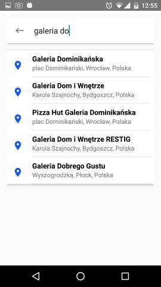
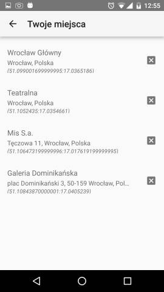
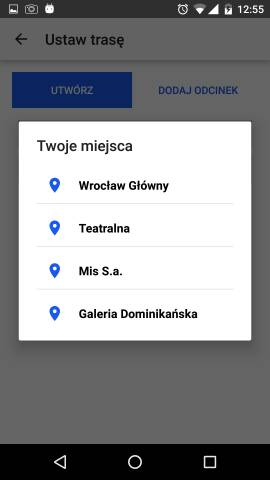
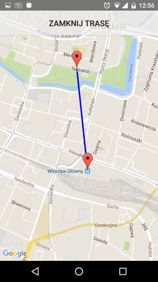

# Description #

An app that allows user to add his favourite place directly on the map or by using search engine. All places are presented on the map and can by filtered by distance. Also, user can create a route based on places from his favourites list.

### Used ###

* [Google Maps Api](https://developers.google.com/maps/)
* [Google Places Api](https://developers.google.com/places/)
* [Floating Action Button Library](https://github.com/Clans/FloatingActionButton)

### Screenshots ###

